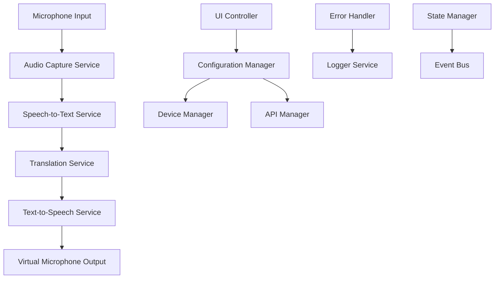

# Design Document

## Overview

The Real-Time Voice Translator is an Electron-based desktop application that creates a real-time audio processing pipeline. The application captures user speech, processes it through speech-to-text, translation, and text-to-speech services, then outputs the result to a virtual microphone device. The architecture emphasizes modularity, error resilience, and minimal latency.

## Architecture

### High-Level Architecture



### Process Flow

1. **Audio Capture**: Continuous audio recording from selected input device
2. **Voice Activity Detection**: Identify speech segments to process
3. **Speech-to-Text**: Convert audio segments to text using Whisper
4. **Translation**: Translate text to target language using configured API
5. **Text-to-Speech**: Generate audio using user's cloned voice via ElevenLabs
6. **Audio Output**: Stream synthesized audio to virtual microphone

### Technology Stack

- **Frontend**: Electron with HTML/CSS/JavaScript
- **Audio Processing**: Web Audio API + Node.js audio libraries
- **Speech-to-Text**: OpenAI Whisper API
- **Translation**: OpenAI API (primary), Google Translate API (fallback)
- **Text-to-Speech**: ElevenLabs API
- **Virtual Audio**: Integration with VB-Audio Cable or similar

## Components and Interfaces

### Core Services

#### AudioCaptureService
```typescript
interface AudioCaptureService {
  startCapture(deviceId: string): Promise<void>
  stopCapture(): void
  onAudioData(callback: (audioBuffer: ArrayBuffer) => void): void
  getAvailableDevices(): Promise<AudioDevice[]>
}
```

**Responsibilities:**
- Manage microphone access and permissions
- Capture audio in real-time using Web Audio API
- Handle device selection and switching
- Provide audio data in appropriate format for STT

#### SpeechToTextService
```typescript
interface SpeechToTextService {
  transcribe(audioBuffer: ArrayBuffer): Promise<TranscriptionResult>
  setLanguage(language: string): void
}

interface TranscriptionResult {
  text: string
  confidence: number
  language: string
}
```

**Responsibilities:**
- Interface with Whisper API for transcription
- Handle audio format conversion for API requirements
- Manage API rate limiting and error handling
- Return transcription with confidence scores

#### TranslationService
```typescript
interface TranslationService {
  translate(text: string, targetLanguage: string): Promise<TranslationResult>
  getSupportedLanguages(): string[]
  setProvider(provider: 'openai' | 'google' | 'deepl'): void
}

interface TranslationResult {
  translatedText: string
  sourceLanguage: string
  targetLanguage: string
  confidence?: number
}
```

**Responsibilities:**
- Manage multiple translation API providers
- Handle provider failover and load balancing
- Cache common translations for performance
- Support language detection and validation

#### TextToSpeechService
```typescript
interface TextToSpeechService {
  synthesize(text: string, voiceId: string): Promise<AudioBuffer>
  getAvailableVoices(): Promise<Voice[]>
  cloneVoice(audioSamples: ArrayBuffer[]): Promise<string>
}

interface Voice {
  id: string
  name: string
  isCloned: boolean
}
```

**Responsibilities:**
- Interface with ElevenLabs API for voice synthesis
- Manage voice cloning process and voice profiles
- Handle audio format optimization for output
- Provide voice quality and speed controls

#### VirtualMicrophoneService
```typescript
interface VirtualMicrophoneService {
  initialize(): Promise<void>
  sendAudio(audioBuffer: ArrayBuffer): Promise<void>
  isAvailable(): boolean
  getDeviceInfo(): VirtualDeviceInfo
}
```

**Responsibilities:**
- Interface with virtual audio cable software
- Stream synthesized audio to virtual microphone
- Handle audio format conversion and timing
- Manage virtual device availability and status

### UI Components

#### MainWindow
- Primary application interface
- Houses all control components
- Manages window state and lifecycle

#### DeviceSelector
- Dropdown for microphone selection
- Real-time device availability updates
- Device permission handling

#### LanguageSelector
- Target language selection dropdown
- Language pair validation
- Supported language filtering

#### TranslationControls
- Start/Stop toggle button
- Test functionality button
- Real-time status indicators

#### DebugConsole
- STT, translation, and TTS step logging
- Error message display
- Performance metrics (optional)

### Configuration Management

#### ConfigurationManager
```typescript
interface ConfigurationManager {
  getConfig(): AppConfig
  updateConfig(config: Partial<AppConfig>): void
  resetToDefaults(): void
}

interface AppConfig {
  selectedMicrophone: string
  targetLanguage: string
  translationProvider: string
  voiceId: string
  debugMode: boolean
  apiKeys: ApiKeys
}
```

## Data Models

### Audio Processing Models

```typescript
interface AudioSegment {
  id: string
  audioData: ArrayBuffer
  timestamp: number
  duration: number
  processed: boolean
}

interface ProcessingResult {
  segmentId: string
  originalText: string
  translatedText: string
  audioOutput: ArrayBuffer
  processingTime: number
  errors?: ProcessingError[]
}
```

### Configuration Models

```typescript
interface ApiKeys {
  openai: string
  elevenlabs: string
  google?: string
  deepl?: string
}

interface AudioDevice {
  id: string
  label: string
  kind: 'audioinput' | 'audiooutput'
  available: boolean
}
```

## Error Handling

### Error Categories

1. **API Errors**: Network failures, rate limiting, authentication issues
2. **Audio Errors**: Device access, format conversion, virtual microphone issues
3. **Processing Errors**: Transcription failures, translation errors, synthesis problems
4. **Configuration Errors**: Invalid settings, missing API keys, device unavailability

### Error Handling Strategy

```typescript
interface ErrorHandler {
  handleError(error: ProcessingError): void
  shouldRetry(error: ProcessingError): boolean
  getRecoveryAction(error: ProcessingError): RecoveryAction
}

enum RecoveryAction {
  RETRY,
  SKIP_SEGMENT,
  FALLBACK_PROVIDER,
  PAUSE_PROCESSING,
  NOTIFY_USER
}
```

### Resilience Patterns

- **Circuit Breaker**: Prevent cascading failures from API services
- **Retry with Backoff**: Handle temporary network issues
- **Graceful Degradation**: Continue processing when non-critical components fail
- **Fallback Providers**: Switch translation/TTS providers on failure

## Testing Strategy

### Unit Testing
- Individual service components (AudioCapture, STT, Translation, TTS)
- Configuration management and validation
- Error handling and recovery logic
- Audio processing utilities

### Integration Testing
- End-to-end audio pipeline testing
- API service integration validation
- Virtual microphone output verification
- Device management and switching

### Performance Testing
- Latency measurement across the full pipeline
- Memory usage monitoring during continuous operation
- API rate limiting and throttling behavior
- Audio quality degradation assessment

### User Acceptance Testing
- Real-world voice chat application integration
- Multi-language translation accuracy
- Voice cloning quality assessment
- Error recovery user experience

### Testing Tools and Frameworks
- **Jest**: Unit and integration testing
- **Electron Testing**: Application lifecycle and UI testing
- **Audio Testing**: Synthetic audio generation for consistent testing
- **API Mocking**: Simulate various API response scenarios

### Test Data Management
- Sample audio files in multiple languages
- Mock API responses for various scenarios
- Configuration test cases for different setups
- Error condition simulation data

### Continuous Testing
- Automated testing pipeline for builds
- Performance regression detection
- API compatibility monitoring
- Cross-platform testing validation